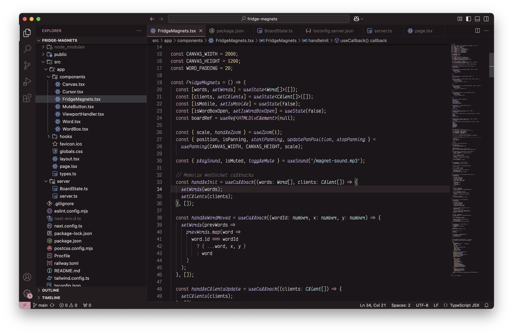

# Champagne VS Code Theme

There aren't enough nice pink themes anywhere, so here's a sleek and elegant VS Code theme with soft, warm tones inspired by my favorite colors that happen to evoke pink champagne.

## Preview

## Installation

1. Open **Extensions** in VS Code (`Cmd + Shift + X` / `Ctrl + Shift + X`).
2. Search for `Champagne`.
3. Click **Install**.
4. Go to **Preferences > Color Theme** and select `Champagne`.

## Feedback

If you have any suggestions or issues, feel free to open an issue in the repository.

## License

MIT License
